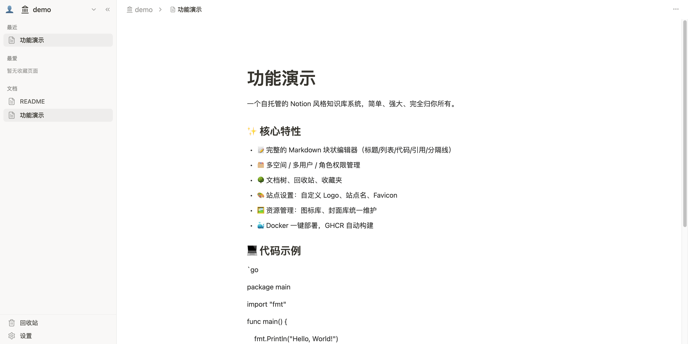
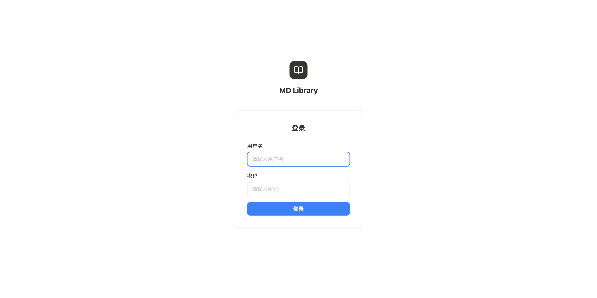
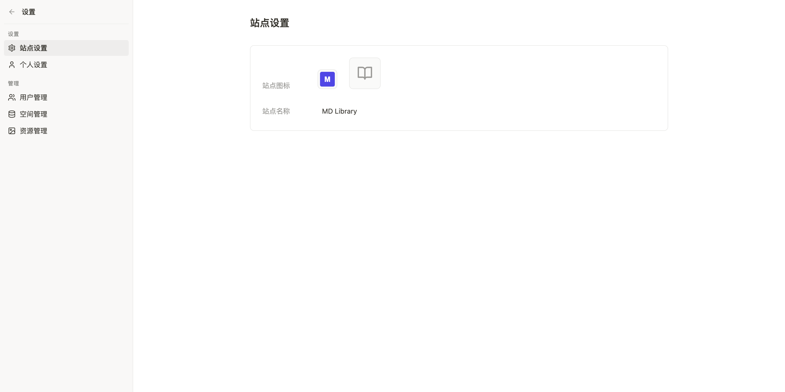
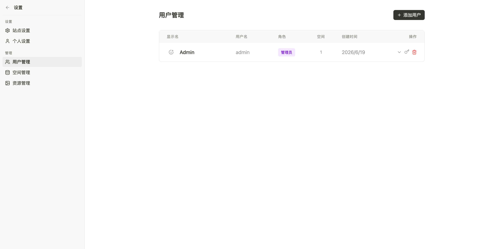
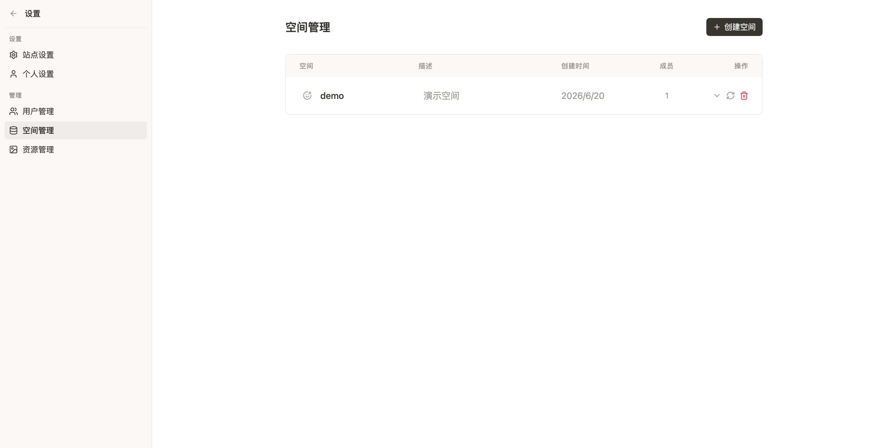
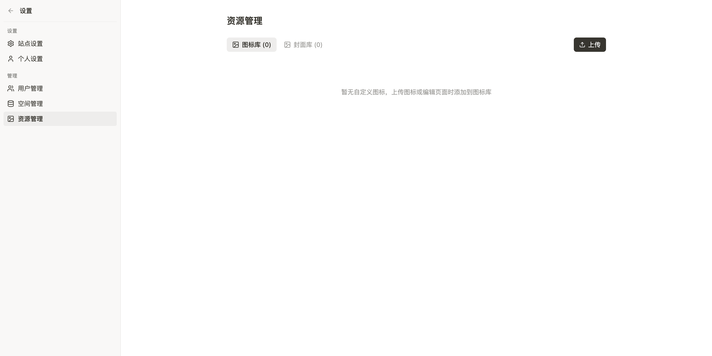

# AKMDLibrary

> 一个自托管的 Notion 风格知识库系统，简单、强大、完全归你所有。



## ✨ 特性

- 📝 **完整的 Markdown 块状编辑器** — 标题、列表、代码块、引用、分隔线等
- 🗂️ **多空间 / 多用户 / 权限** — 管理员/普通用户角色，按空间隔离
- 🌳 **文档树** — 拖拽排序、无限层级、子页面
- 🗑️ **回收站** — 误删可恢复
- ⭐ **收藏夹** — 常用页面快速访问
- 🎨 **站点自定义** — Logo、站点名、Favicon
- 🖼️ **资源管理** — 图标库、封面库统一维护
- 🔍 **页面内查找替换** — Notion 风格浮层
- 🐳 **Docker 一键部署** — GHCR 自动构建

## 📸 界面预览

### 登录页



### 编辑器


### 后台管理

<div align="center">
<table>
  <tr>
    <td align="center">站点设置</td>
    <td align="center">用户管理</td>
  </tr>
  <tr>
    <td></td>
    <td></td>
  </tr>
  <tr>
    <td align="center">空间管理</td>
    <td align="center">资源管理</td>
  </tr>
  <tr>
    <td></td>
    <td></td>
  </tr>
</table>
</div>

## 🚀 快速部署

### 服务器部署（推荐）

使用预构建的 GHCR 镜像，无需源码、无需编译：

```bash
# 1. 准备目录
mkdir -p ~/akmdlibrary && cd ~/akmdlibrary

# 2. 下载 docker-compose.yml
wget https://raw.githubusercontent.com/AlwaysKing/AKMDLibrary/main/docker-compose.yml

# 3. 生成 JWT 密钥
echo "JWT_SECRET=$(openssl rand -hex 32)" > .env

# 4. 拉取镜像并启动
docker compose pull
docker compose up -d
```

服务启动后访问 `http://your-server:8080`，默认管理员账号：

- 用户名：`admin`
- 密码：`admin123`

> ⚠️ **首次登录后请立即在「个人设置」中修改密码。**

### 更新到最新版本

```bash
docker compose pull && docker compose up -d
```

### 查看日志 / 运维

```bash
docker compose logs -f          # 实时日志
docker compose ps               # 运行状态
docker compose down             # 停止服务
```

数据持久化在 `./docs`（文档库）和 `./data`（数据库）两个目录，备份这两个目录即可。

## ⚙️ 环境变量

所有路径和行为都通过环境变量控制，Docker 镜像默认值已配置好，**只有 `JWT_SECRET` 必须显式设置**。

| 变量 | 默认值（容器内） | 用途 |
|---|---|---|
| `PORT` | `8080` | 服务监听端口 |
| `DOCS_DIR` | `/app/docs` | 文档库目录（用户的 markdown 文件） |
| `DATA_DIR` | `/app/data` | 数据目录（SQLite + 上传的图标/封面等） |
| `FRONTEND_DIST` | `/app/html` | 前端静态文件目录（SPA） |
| `JWT_SECRET` | `change-me-in-production` | JWT 密钥，**生产必须改** |

> Docker 部署：mount 时把宿主机目录挂到 `/app/docs` 和 `/app/data` 即可，其他用默认值。
>
> 本地调试：默认值是容器内绝对路径，需要通过 `.env` 覆盖为相对路径（见下文）。

## 💻 本地开发

### 前置要求

- Go 1.25+
- Node.js 20+
- CGO（SQLite 依赖，macOS 自带，Linux 需 `gcc`/`musl-dev`）

### 启动开发服务器

```bash
# 1. 复制环境变量模板（首次）
cp .env.example .env

# 2. 后端（终端 1，监听 :8801）
cd backend
go run ./cmd/server            # godotenv 会自动读取项目根的 .env

# 3. 前端（终端 2，监听 :8802）
cd frontend
npm install
npm run dev
```

浏览器访问 `http://localhost:8802`，vite 会自动代理 `/api` 到后端。

调试时的文档库和数据在项目根的 `userdata/` 目录下（已 gitignore），不会污染项目源码。

## 🛠️ 技术栈

**后端**

- [Go 1.25](https://go.dev) + [Chi v5](https://github.com/go-chi/chi)（HTTP 路由）
- [SQLite](https://www.sqlite.org)（通过 `mattn/go-sqlite3`，需 CGO）
- [JWT](https://github.com/golang-jwt/jwt) 认证

**前端**

- [React 18](https://react.dev) + TypeScript
- [Vite](https://vitejs.dev) 构建
- [BlockNote](https://blocknotejs.org)（Notion 风格块编辑器）
- [Zustand](https://zustand-demo.pmnd.rs) 状态管理
- [Tailwind CSS](https://tailwindcss.com) 样式

**部署**

- Docker 多阶段构建
- GitHub Actions → GHCR 自动发布

## 📁 项目结构

```
.
├── backend/              # Go 后端
│   ├── cmd/server/       # 入口
│   ├── internal/         # 业务代码（handler / service / repository）
│   └── pkg/              # 通用包（filesystem / frontmatter / uuidutil）
├── frontend/             # React 前端
│   └── src/
│       ├── components/   # UI 组件
│       ├── pages/        # 路由页面
│       ├── stores/       # Zustand store
│       └── api/          # API 客户端
├── docs/                 # 文档目录（运行时也存放文档库）
├── Dockerfile            # 多阶段构建
├── docker-compose.yml    # 服务器部署配置
└── .github/workflows/    # CI 自动构建
```
